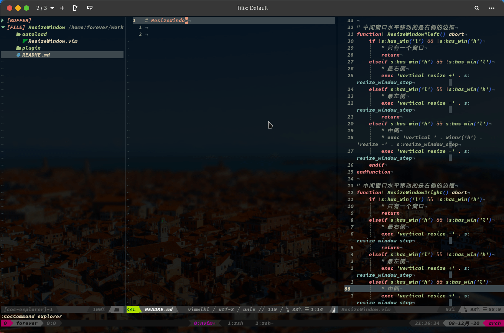

# ResizeWindow



快速更改窗口大小，参考插件[tlr](https://github.com/obcat/tlr.vim)，默认功能如下

### 水平方向

水平方向有以下几种情况：

1. 只有一个窗口，那么左右无法移动
2. 窗口在最右侧，那么左右移动的是当前窗口的左侧边框
3. 窗口在最左侧，那么左右移动的是当前窗口的右侧边框
4. 如果窗口在中间，那么移动的是当前窗口的右侧边框

### 垂直方向

垂直方向有以下几种情况：

1. 只有一个窗口，那么上下无法移动
2. 窗口在最顶部，那么上下移动的是当前窗口的底部边框
3. 窗口在最底部，那么上下移动的是当前窗口的顶部边框
4. 如果窗口在中间，那么移动的是当前窗口的顶部边框

### 快捷键配置

```
nmap <M-->  <Plug>(resize_window_down)
nmap <M-_>  <Plug>(resize_window_up)
nmap <M-(>  <Plug>(resize_window_left)
nmap <M-)>  <Plug>(resize_window_right)
```

### 全局变量

设置每次移动的步长

```viml
let g:resize_window_size = 1
```

